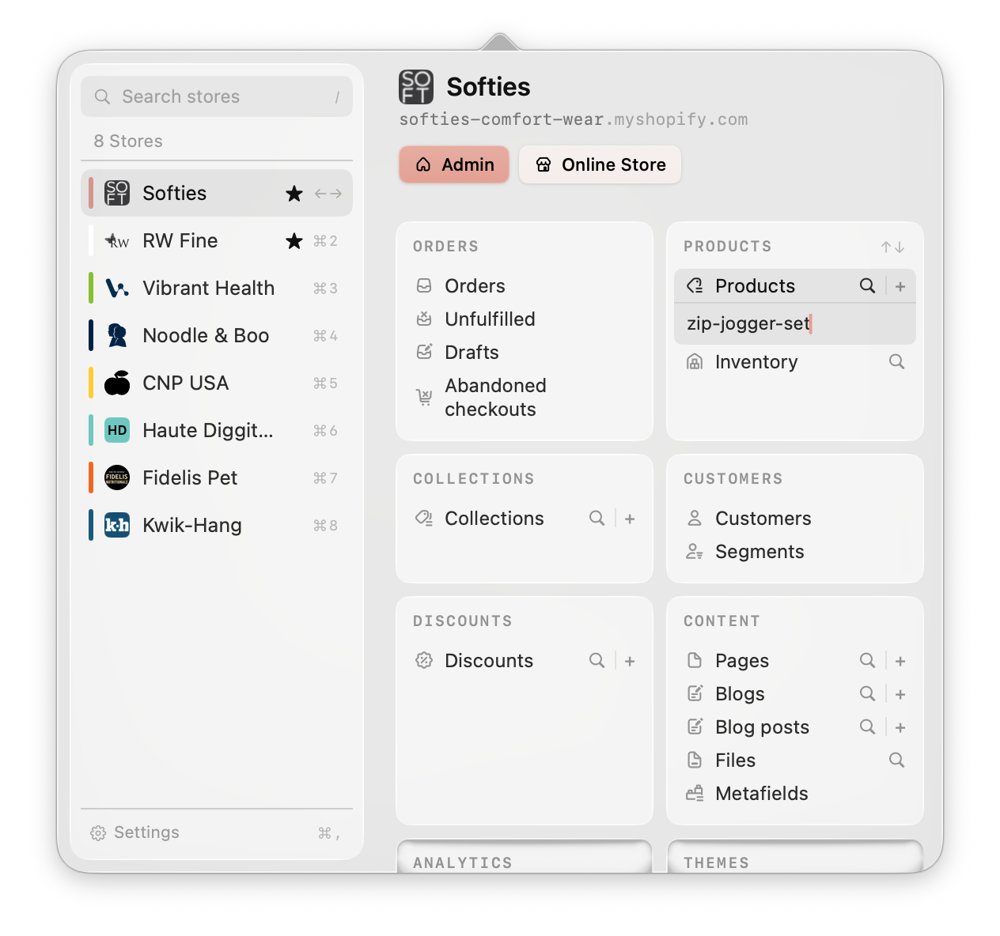

# Storefront

A macOS menu bar app that gets you into any Shopify store's admin panel in seconds — no Dock icon, no bookmarks folder, no hunting through browser tabs. Hit a global hotkey, pick a store, jump straight to the section you need.

Built for people who live across many Shopify stores at once — **Shopify Partners and agency developers, marketers, and store managers** juggling client accounts, rather than a single merchant running one shop. If you're regularly context-switching between a dozen stores' admin panels, Storefront turns that into a keyboard shortcut and a couple of keystrokes.



## Download

**[Download the latest release](https://github.com/nuotsu/storefront-macos-menubar/releases/latest/download/Storefront.dmg)** (macOS 14+)

This build isn't signed with an Apple Developer ID, so macOS Gatekeeper will flag it on first launch. To open it:

1. Right-click (or Control-click) `Storefront.app` and choose **Open**, then confirm in the dialog that appears — you only need to do this once.
2. If macOS still refuses, run this in Terminal instead: `xattr -cr /Applications/Storefront.app`

The app checks for updates automatically after that (Settings → General, or **Check for Updates…** in the status-bar right-click menu).

## Features

- **Multi-store rail** — search, favorite, and reorder the stores you manage
- **Section-based deep links** — Products, Collections, Themes, Orders, Discounts, Settings, Apps, Analytics, Content, Customers, each with its own quick links (and "New +" actions where it makes sense)
- **Per-store accent color**, with automatic black/white text contrast
- **Global hotkey** to open the panel from anywhere (configurable in Settings → General)
- **Full keyboard navigation** — arrow keys to move through stores and section cards (loops at either end), `⌘1`-`⌘9` to jump to a store, Return to open a link, Esc to back out, `⌘Q` or the status-bar right-click menu to quit
- **CSV import/export** for the store list — hand off or bulk-load a client roster in one shot
- **Configurable sections** — enable/disable and reorder which sections show up, globally

Storefront only ever opens links in your default browser using your own logged-in admin session — it doesn't talk to the Shopify API and doesn't store any credentials. That means it works with however you already access each store (staff account, collaborator access, Partner org), with nothing extra to configure per store beyond its URL.

## Requirements

- macOS 14.0+
- Xcode 16+
- [XcodeGen](https://github.com/yonaskolb/XcodeGen) (`brew install xcodegen`)

## Building

The `.xcodeproj` is generated, not checked in. After cloning:

```sh
xcodegen generate
open Storefront.xcodeproj
```

Re-run `xcodegen generate` any time `project.yml` changes (adding/removing files, entitlements, etc.).

## Usage

- Click the bag icon in the menu bar, or press the configured global hotkey (default `⌃⌥⌘S`)
- Type to search stores; arrow keys move selection
- Press → to move into the section-card grid, ↑/↓/←/→ to navigate cards and links (wraps at either end), Return to open the focused link
- Esc steps back out one level at a time, then closes the panel
- Right-click the menu bar icon for quick links (Settings, Stores, Sections) or Quit

## Settings

- **Stores** — add, edit, reorder, show/hide, recolor, import/export CSV
- **Sections** — enable/disable and reorder the section cards shown for every store
- **General** — launch at login, global hotkey, menu bar icon style, version/about

## License

[MIT](LICENSE). Developed by [nuotsu](https://nuotsu.dev).
